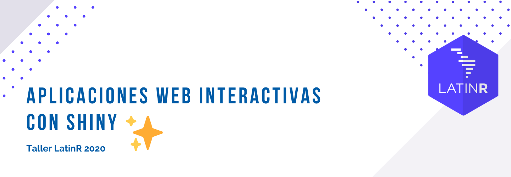

# Taller de Shiny en LatinR 2020

## Profes

* [Florencia D'Andrea](https://florencia.netlify.app/es-es/)
* [Juan Cruz Rodríguez](https://jcrodriguez.rbind.io/)
* [Vilma Romero](https://vilmaromero.github.io/)


## Emoji Shiny app

### Información para usuaries

Puedes bajarte la app a tu computadora usando el siguiente código

``` 
library(remotes)
remotes::install_github("flor14/latinr_shiny_2020", subdir = "emojidataexplorer")
library(emojidataexplorer)
emojidataexplorer::emojiapp_run()
```
 ## ¿Qué hay en el repositorio?
 
 * Carpeta `emojidataexplorer` tiene el código del paquete.
 
 * Carpeta `emoji_data_explorer` tiene las primeras versiones del código, incluye otras formas de incluir emojis en los ejes del gráfico.
 
 * Carpeta `material_taller` tiene los archivos qe se van a usar el día del taller. Puedes acceder a los mismos de forma interactiva usando [Binder](https://mybinder.org/v2/gh/flor14/latinr_shiny_2020.git/binder?urlpath=rstudio/).
 

## Links de interés

* [Cheatsheet de Shiny](https://github.com/rstudio/cheatsheets/raw/master/translations/spanish/shiny_Spanish.pdf) [español]: Hoja resumen de las funciones y estructuras más utilizadas para crear Shiny apps.

* [Referencia de funciones de Shiny](https://shiny.rstudio.com/reference/shiny/1.5.0/) [inglés]: Listado con todas las funciones de Shiny, organizadas y con una pequeña descripción.

* [Galería de apps de Shiny](https://shiny.rstudio.com/gallery/) [inglés]: Página con muchas Shiny app de ejemplo. Permite jugar con las app de ejemplo, y presenta todo el código necesario para replicar estas app en tu computadora. La [sección de Widgets](https://shiny.rstudio.com/gallery/#widgets) resulta muy útil para quien comienza con el mundo de Shiny.

* [Mastering Shiny](https://mastering-shiny.org/) [inglés]: Libro completísimo que te lleva desde 0 a Shiny master.

* [Engineering Production-Grade Shiny Apps](https://engineering-shiny.org/) [inglés]: Libro que te enseña buenas prácticas para generar una Shiny app modularizable y escalable, lista para tener en producción.

* [How to build a Shiny app from scratch](https://bookdown.org/hadrien/how_to_build_a_shiny_app_from_scratch/) [inglés]: Libro básico con algunas aclaraciones sobre funcionamiento de la UI interesantes


## Lineamientos para contribuir con la app

Reporte de errores:

- Preguntas, comentarios, informes de errores: abra un `issue` en el repositorio de este proyecto [aquí](https://github.com/flor14/latinr_shiny_2020/issues).

Contribuye a nuestro software:

- Abra un `issue` en este repositorio que describa los cambios que le gustaría realizar en el software y realice un `pull request` con los cambios. La descripción del `pull request` debe hacer referencia al problema correspondiente.
